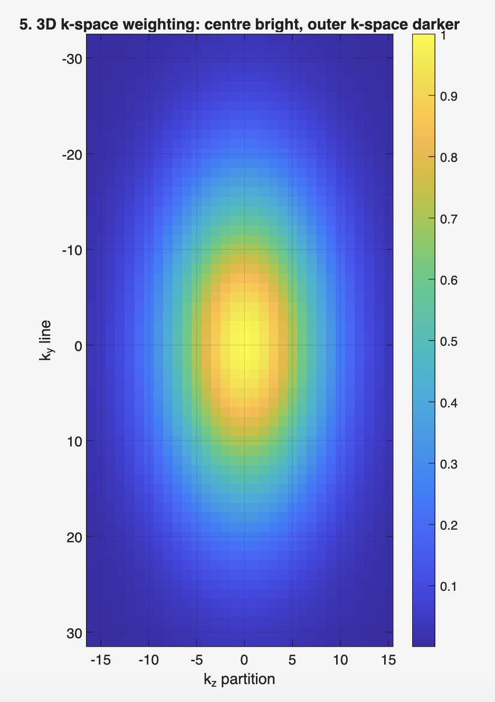
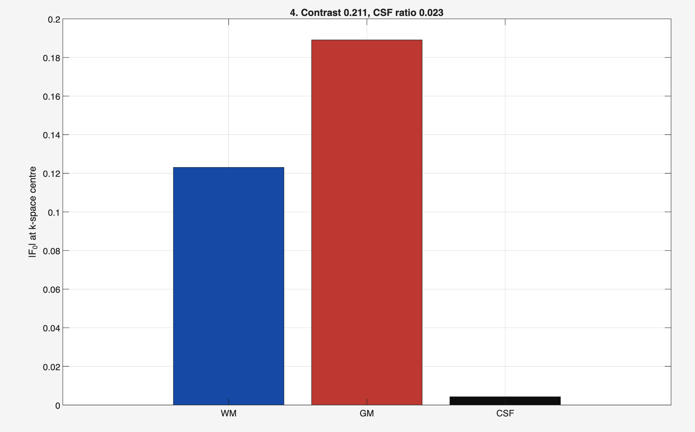

# 3D EPG EPI FLAIR — Detailed Description

This repository contains a simulator built around the Extended Phase Graph (EPG) formalism to model Turbo Spin Echo (TSE) sequences, Fluid-Attenuated Inversion Recovery (FLAIR), and 3D Echo Planar Imaging (3D EPI) readouts. The core functions are located in the `EPGX_functions/` directory and include full implementations of `EPG_TSE_Explained.m`, `EPG_TSE.m`, and `EPG_shift_matrices.m`.

FLAIR (Fluid-Attenuated Inversion Recovery) uses an inversion pulse followed by a chosen inversion time (`TI`) that causes tissues with a specific T1 (for example cerebrospinal fluid) to cross zero longitudinal magnetisation at the excitation, thereby nulling their signal and enhancing lesion contrast near CSF. In the simulator, inversion recovery is handled by computing an initial longitudinal magnetisation `Mz_init = 1 - 2*exp(-TI/T1)` which becomes the starting `Z0` prior to excitation.

3D EPI (3D Echo Planar Imaging) is a volumetric, fast acquisition method that collects partitions along one dimension and EPI readouts along the in-plane axes. The 3D k-space trajectory, echo ordering, and resulting point spread function differ from conventional 2D readouts; the simulator explicitly models readout ordering, gradient blips, and echo timing so the resulting k-space and PSF can be inspected.

Below are the seven figures produced by the simulation. Each figure is shown inline (sourced from the repository's `Figures/` directory) and followed by a detailed explanation of how the figure was produced and what to inspect to validate the simulation.

Figure: 3D k-space

This image visualises the three-dimensional k-space sampling produced by the 3D EPI readout. The EPI readout rapidly traverses the readout axis while small phase-encode blips occur between echoes; between shots the partition index advances to sample the third (kz) axis. When validating the simulator, inspect the ordering and density of lines: contiguous streaks along the EPI axis should correspond to sequential echoes, and partition increments should be uniform across the kz extent. If the pattern shows unexpected gaps, irregular ordering, or swapped axes, it indicates an error in how phase-encode increments or partition loops are implemented. Correct appearance confirms the simulator applies gradient blips and partition progression correctly and that timing of echo acquisition is accurate for the modeled EPI scheme.

Figure: Dynamic EPG State

This plot shows how coherence orders (transverse `F` states and longitudinal `Z` states) evolve through the pulse train. The horizontal axis represents pulse or time index and the vertical axis labels EPG order; intensity encodes magnitude. Important validation points are: (1) higher-order transverse coherences appear immediately after refocusing pulses and then decay through T2; (2) the `Z0` longitudinal state displays inversion and recovery behavior when `TI` is applied (for FLAIR); and (3) conjugation relationships between positive and negative coherence orders are preserved. Observing these behaviors confirms that the `RF_rot` rotation, the replication `build_T`, the `S` shift matrices, and the composite relax-shift operator `SE` are operating together correctly to evolve the state vector.

Figure: EPI Echo Train

This figure plots the simulated echo magnitudes (and possibly phase) measured during the EPI readout across consecutive echoes. The expected signature is an amplitude envelope shaped by T2 decay and modulations resulting from imperfect refocusing (non-180° flips) or stimulated echoes. To verify the simulation, check that echo spacing matches `ESP`, that amplitudes decay as predicted for the chosen `T2`, and that phase progression matches the RF phase schedule. If diffusion or off-resonance is enabled, their effects (attenuation or phase shifts) will also appear in the echo train. Agreement with these expectations demonstrates the simulation correctly applies evolution between RF events and records echoes at the intended times.

Figure: Effective echo

This plot shows the net observable echo timing and amplitude once the simulation accounts for half-ESP evolution on either side of RF pulses. The simulator records echoes after half-ESP evolution and before the next RF; this figure demonstrates whether that convention is implemented correctly. Verify that echo centering matches the acquisition model you expect (midpoint of the readout window) and that amplitudes correspond to the state vector magnitudes at those instants. Any consistent offset indicates a timing convention mismatch between how `ESP` splitting and echo recording are implemented.

Figure: FLAIR Recovery

This plot charts longitudinal magnetisation following inversion as a function of time (or `TI`). The curve should closely follow the mono-exponential recovery `Mz(t) = 1 - 2*exp(-t/T1)` prior to the excitation pulse; the null point (where `Mz` crosses zero) should be near `TI ≈ T1 * ln(2)` for a simple model. This figure validates that the code applies inversion pulses, computes `Mz_init` correctly, and uses it as the starting `Z0` for the subsequent EPG simulation. When generating or reading this figure, ensure the TI sweep resolution is fine enough to locate the null and that axis units match the time convention used in the simulation.

Figure: PSF

The Point Spread Function (PSF) represents how a point object maps into image space given the simulated k-space sampling and echo weighting from the EPI train. The PSF shows the main lobe (resolution) and sidelobes (ringing or aliasing) whose pattern depends on readout window width, partition sampling, and any apodisation due to echo amplitude envelope. Inspect the PSF for expected main lobe width consistent with k-space coverage and for sidelobe patterns that reflect sampling density and ordering. Unexpected asymmetry or artifact structures often indicate issues in k-space ordering or missing complex-phase terms in k-space accumulation.

Figure: TI Optimisation

This figure presents the residual signal of the tissue of interest (e.g., CSF surrogate) as `TI` varies. It is used to select the inversion time that minimises that tissue's signal. Key validation checks are: the TI sweep range covers the predicted null point, the step size is sufficiently fine to resolve the minimum, and the curve around the minimum is smooth (indicating stable numeric computation rather than noise). A well-formed dip near the analytic null time indicates that inversion recovery and the `Mz_init` calculation are functioning as intended.

If the images still do not appear for you on GitHub, try clearing the browser cache or viewing the README directly at:

https://github.com/viilerr/3D-EPG-EPI-FLAIR/blob/main/README.md

or open a direct image URL, for example:

https://github.com/viilerr/3D-EPG-EPI-FLAIR/raw/main/Figures/3D_k-space.png

