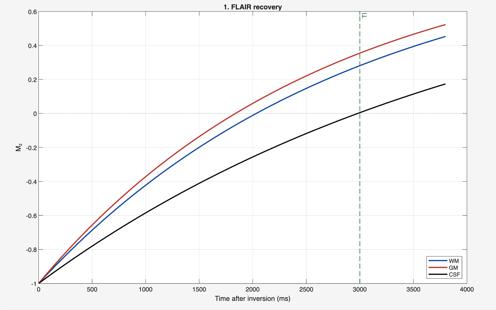
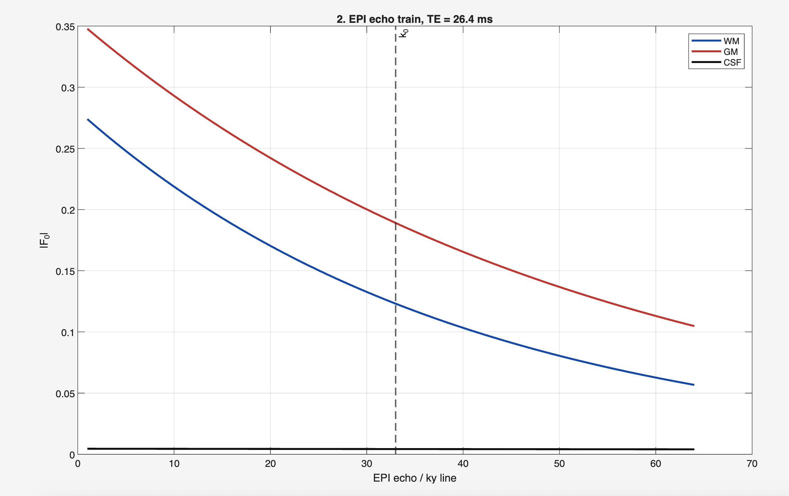
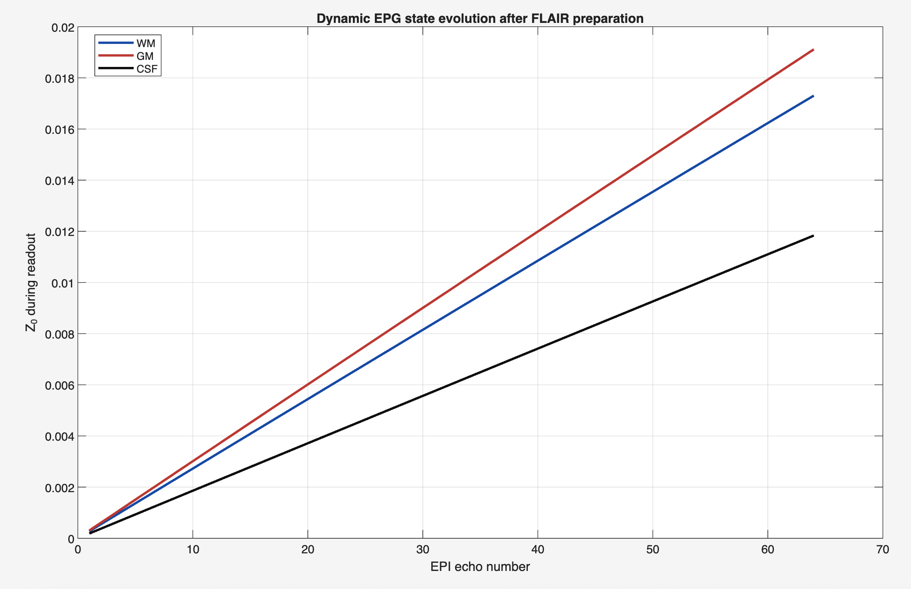
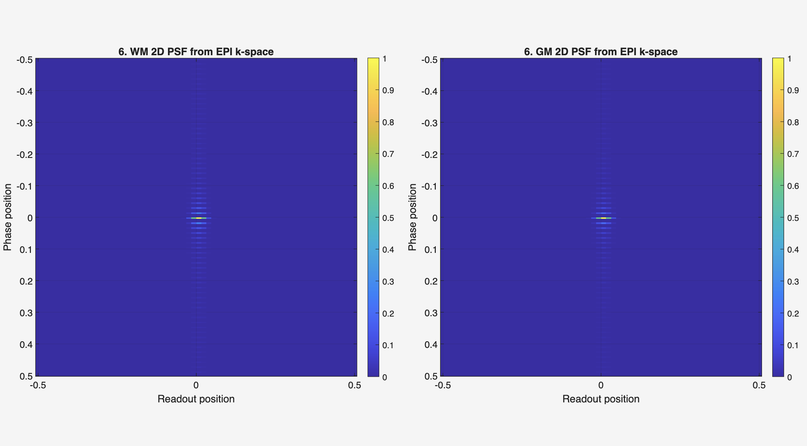
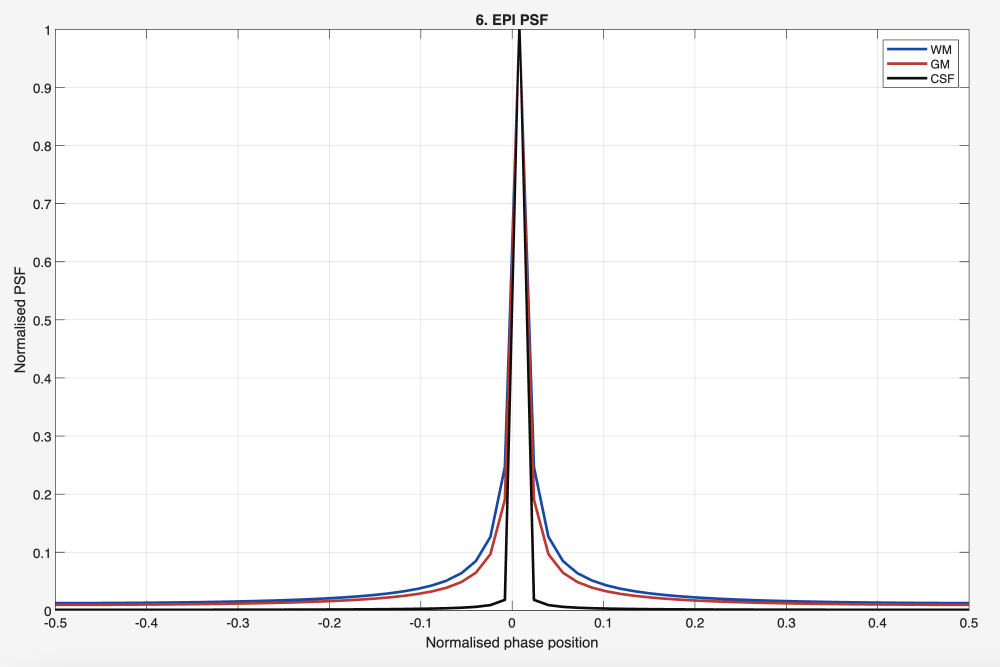
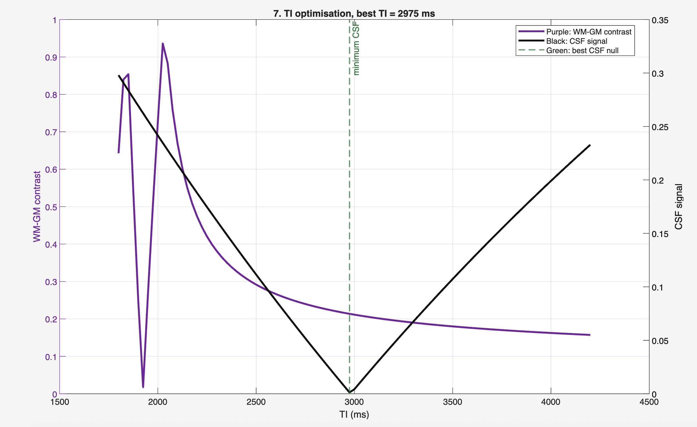

# EPG-FLAIR

Adaptation of TSE EPG code to include FLAIR, plus a FLAIR EPI test
workflow.

## Files

- `EPG_FLAIR.m` simulates either the original FLAIR-prepared TSE pathway or
  a 3D FLAIR EPI pathway selected with `'sequence','epi3d'`.
- `testrun.m` runs the FLAIR EPI checks for WM, GM, and CSF and shows all
  plots in one figure window.

## 3D FLAIR EPI model

The EPI mode keeps the FLAIR inversion preparation, then changes the readout
from a refocused TSE echo train to a dynamic gradient-echo EPI train. This
means:

- TI controls longitudinal recovery and CSF nulling before excitation.
- The excitation creates transverse signal proportional to `sin(flipAngle)`.
- FLAIR preparation is included in both TSE and EPI through the shared
  `flair_prep` helper: 180 degree inversion, TI relaxation with T1/T2, then
  imaging excitation.
- EPI readout decay uses `T2star`, not T2, because gradient-echo EPI is not
  refocused by 180 degree pulses.
- The EPG state vector is updated during the sequence: inversion pulse, TI
  relaxation, excitation pulse, then each EPI echo.
- The returned `Fn` output is a ky-kz matrix for the 3D k-space weighting.
- `testrun.m` also builds a 2D 64 x 3 EPI example: 64 signal values from the
  WM/GM echo trains are repeated over 3 segments to fill 192 zigzag k-space
  lines, then a 2D PSF is calculated from that filled k-space.

Example:

```matlab
[F0,K3D,Zn,F,info] = EPG_FLAIR(deg2rad(90),0.8,T1,T2,3000, ...
    'sequence','epi3d','T2star',40,'nPE',64,'nPartitions',32);
```
This repository contains a simulator built around the Extended Phase Graph (EPG) formalism to model Turbo Spin Echo (TSE) sequences, Fluid-Attenuated Inversion Recovery (FLAIR), and 3D Echo Planar Imaging (3D EPI) readouts. The core functions are located in the `EPGX_functions/` directory and include full implementations of `EPG_TSE_Explained.m`, `EPG_TSE.m`, and `EPG_shift_matrices.m`.

FLAIR (Fluid-Attenuated Inversion Recovery) uses an inversion pulse followed by a chosen inversion time (`TI`) that causes tissues with a specific T1 (for example cerebrospinal fluid) to cross zero longitudinal magnetisation at the excitation, thereby nulling their signal and enhancing lesion contrast near CSF. In the simulator, inversion recovery is handled by computing an initial longitudinal magnetisation `Mz_init = 1 - 2*exp(-TI/T1)` which becomes the starting `Z0` prior to excitation.

3D EPI (3D Echo Planar Imaging) is a volumetric, fast acquisition method that collects partitions along one dimension and EPI readouts along the in-plane axes. The 3D k-space trajectory, echo ordering, and resulting point spread function differ from conventional 2D readouts; the simulator explicitly models readout ordering, gradient blips, and echo timing so the resulting k-space and PSF can be inspected.

Below are the seven figures produced by the simulation. Each figure is shown inline (sourced from the repository's `Figures/` directory) and followed by a detailed explanation of how the figure was produced and what to inspect to validate the simulation.

## Figure 1: FLAIR Recovery



This plot charts longitudinal magnetisation following inversion as a function of time (or `TI`). The curve should closely follow the mono-exponential recovery `Mz(t) = 1 - 2*exp(-t/T1)` prior to the excitation pulse; the null point (where `Mz` crosses zero) should be near `TI ≈ T1 * ln(2)` for a simple model. This figure validates that the code applies inversion pulses, computes `Mz_init` correctly, and uses it as the starting `Z0` for the subsequent EPG simulation. When generating or reading this figure, ensure the TI sweep resolution is fine enough to locate the null and that axis units match the time convention used in the simulation.

## Figure 2: EPI Echo Train



This figure plots the simulated echo magnitudes (and possibly phase) measured during the EPI readout across consecutive echoes. The expected signature is an amplitude envelope shaped by T2 decay and modulations resulting from imperfect refocusing (non-180° flips) or stimulated echoes. To verify the simulation, check that echo spacing matches `ESP`, that amplitudes decay as predicted for the chosen `T2`, and that phase progression matches the RF phase schedule. If diffusion or off-resonance is enabled, their effects (attenuation or phase shifts) will also appear in the echo train. Agreement with these expectations demonstrates the simulation correctly applies evolution between RF events and records echoes at the intended times.

## Figure 3: Dynamic EPG States



This plot shows how coherence orders (transverse `F` states and longitudinal `Z` states) evolve through the pulse train. The horizontal axis represents pulse or time index and the vertical axis labels EPG order; intensity encodes magnitude. Important validation points are: (1) higher-order transverse coherences appear immediately after refocusing pulses and then decay through T2; (2) the `Z0` longitudinal state displays inversion and recovery behavior when `TI` is applied (for FLAIR); and (3) conjugation relationships between positive and negative coherence orders are preserved. Observing these behaviors confirms that the `RF_rot` rotation, the replication `build_T`, the `S` shift matrices, and the composite relax-shift operator `SE` are operating together correctly to evolve the state vector.

## Figure 4: 2D WM/GM k-space


Figure 4  shows the 2D EPI k-space trajectory for WM and GM separately. Each panel is one tissue type. The plot has 64 x 3 = 192 phase-encoding lines, matching what your supervisor described. The line direction alternates left-to-right then right-to-left, so it looks like a zigzag EPI readout. The brightness/color strength of each line comes from the simulated 64-point EPI signal train for that tissue, repeated across the 3 segments. This is useful because it shows how the WM and GM signals are actually placed into k-space, rather than just plotting signal versus echo number.

## Figure 5: PSF k-space



Figure 5 shows the 2D PSF calculated from the filled 2D k-space in Figure 5. In other words, after using the WM/CM EPI signals f weight k-space, the code applies a 2D inverse Fourier transform to see how a point object would appear in image space. This is useful because it tells you about image blurring: if the k-space weighting decays strongly across the EPI readout, the PS becomes broader, meaning more blur. Comparing WM and GM PSFs shows whether their different relaxation values produce different spatial blurring.

## Figure 6: PSF



The Point Spread Function (PSF) represents how a point object maps into image space given the simulated k-space sampling and echo weighting from the EPI train. The PSF shows the main lobe (resolution) and sidelobes (ringing or aliasing) whose pattern depends on readout window width, partition sampling, and any apodisation due to echo amplitude envelope. Inspect the PSF for expected main lobe width consistent with k-space coverage and for sidelobe patterns that reflect sampling density and ordering. Unexpected asymmetry or artifact structures often indicate issues in k-space ordering or missing complex-phase terms in k-space accumulation.

## Figure 7: TI Optimisation



This figure presents the residual signal of the tissue of interest as `TI` varies. It is used to select the inversion time that minimises that tissue's signal. Key validation checks are: the TI sweep range covers the predicted null point, the step size is sufficiently fine to resolve the minimum, and the curve around the minimum is smooth (indicating stable numeric computation rather than noise). A well-formed dip near the analytic null time indicates that inversion recovery and the `Mz_init` calculation are functioning as intended.


If the images still do not appear for you on GitHub, try clearing the browser cache or viewing the README directly at:

https://github.com/viilerr/3D-EPG-EPI-FLAIR/blob/main/README.md

or open a direct image URL, for example:

https://github.com/viilerr/3D-EPG-EPI-FLAIR/raw/main/Figures/3D_k-space.png


